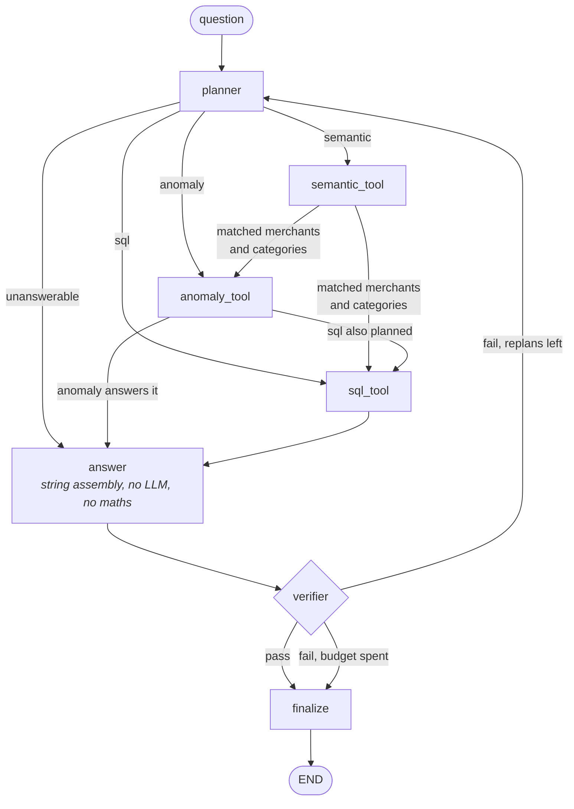
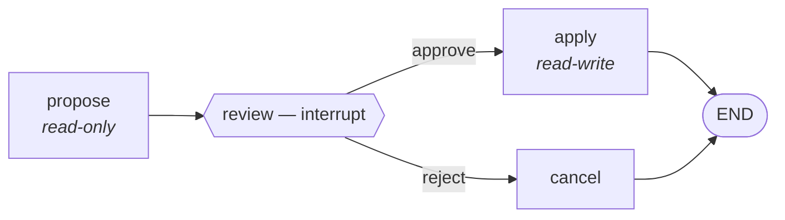

# LedgerLens

**An agentic personal expense analyst.** It reads your bank statements, normalizes them into
SQLite, and answers questions in plain English — with every number traced back to a query result.

Ask a general-purpose chatbot "how much did I spend on groceries in March?" and you get a
confident number with no provenance, which in a financial context is worse than no answer.
LedgerLens makes that structurally impossible:

- **The LLM writes SQL; SQLite computes.** The answer node does no arithmetic.
- **A verifier rejects any figure that doesn't appear in a retrieved row** — deterministic, no
  LLM, no network.
- **Every write waits on an explicit human approval**, on a graph parked at an interrupt.
- **It also works unprompted** — monthly detectors tell you what changed without being asked.

---

## Quickstart

```bash
git clone <repo> && cd ledgerlens
python -m venv myenv && myenv/bin/pip install -r requirements.txt
echo 'GROQ_API_KEY="gsk_..."' > .env

myenv/bin/python -m ledgerlens.synthetic                                          # build a demo ledger
myenv/bin/python -m ledgerlens.ingest --init --resolve data/synthetic/transactions.csv
myenv/bin/uvicorn ledgerlens.api.main:app --reload
```

Open **http://127.0.0.1:8000** — one self-contained page, no CDN and no build step, with four
tabs: **Ask**, **Data**, **Review**, **Upload**. `/docs` is the API, `/api` the route index.

<details>
<summary><b>Using it on your own statements</b></summary>

`ledger.db` is the **benchmark** ledger — the golden set's expected values are sums over exactly
those 832 synthetic rows, so real data landing in it silently invalidates the answer key. Point
real statements somewhere else:

```bash
LEDGERLENS_DB=private.db myenv/bin/python -m ledgerlens.ingest --init statement.pdf
LEDGERLENS_DB=private.db myenv/bin/uvicorn ledgerlens.api.main:app --reload
```

Unset, everything behaves as before. `*.db` is gitignored, as is `data/private/`.

Two things to expect from a **checking** statement: most rows are `transfer`, not `purchase` —
card payments, Zelle, internal moves — and every analytic filter is on `type = 'purchase'`, so
spending totals will legitimately read near zero. Purchases live on the card statement. The
parser also refuses a file whose transactions don't reconcile against the printed running
balance, which is the cheapest way to catch a misparse before it becomes ground truth.
</details>

<details>
<summary><b>Deploying it somewhere public</b></summary>

**Not Vercel, and not any serverless host.** Three blockers: `sentence-transformers`
pulls in `torch` (518 MB against a 250 MB function limit), `/ingest` and every approval
write to a SQLite file that an ephemeral filesystem would discard, and paused approvals
live in an in-memory checkpointer that a second invocation cannot see. This is a
stateful container, so it needs a container host with a disk.

`Dockerfile` and `render.yaml` are in the repo. On [Render](https://render.com),
*New → Blueprint* pointed at the repo reads the blueprint and provisions the disk;
Railway and Fly.io take the same Dockerfile. Set `GROQ_API_KEY` in the dashboard — never
in the blueprint. First boot seeds the synthetic ledger onto the volume; every boot after
finds it and skips.

**A public instance must set `LEDGERLENS_DEMO=1`.** There is no authentication, so
without it the open write routes let any visitor upload into your ledger or approve
changes to it. With it, `/ingest` and both approval routes return 403 and everything
else works — which is the right shape for a demo over synthetic data anyway. Host the
synthetic ledger, not your own statements.

</details>

---

## Architecture

The query path is a LangGraph `StateGraph` with a replan cycle:



Four things about this shape are deliberate:

- **`answer` does no arithmetic.** It formats retrieved rows and nothing else. Anything it
  invented would be a figure with no provenance.
- **The tools are a chain, not a fan-out.** A plan naming one tool runs one tool; a plan naming
  two runs both. As parallel branches, a plan reading *anomaly then sql* silently dropped the sql.
- **`semantic` hands over names, not ids.** Retrieval resolves what the wording *means* — "gym
  membership" appears in no bank descriptor, but the rows it finds are all Planet Fitness — and
  SQL then aggregates the whole merchant. Filtering on the retrieved ids instead caps every total
  at `TOP_K = 20` rows and *passes verification*, because every figure did come from a retrieved row.
- **Hitting the replan cap is a legitimate outcome.** An honest "I couldn't verify this" beats a
  confident wrong number, so the graph may finish without an answer.

Writes live in a second, smaller graph that pauses on `interrupt`:



`propose` opens a read-only connection; `apply` is the only writable one in the agent path. The
pause is the mechanism, not a check — a function that decides *and* writes can always be called
with the decision defaulted, but a graph parked on an interrupt has no default to default to.

---

## Results

| | |
|---|---|
| Text-to-SQL execution accuracy, 46 answerable queries | **80.4%** *(historical)* |
| Refusal accuracy, 7 unanswerable queries | **100%** *(historical)* |
| SQL validity, first attempt | **100%** *(historical)* |
| Verifier catch rate on injected wrong numbers | **100%** (161/161) |
| Verifier false-rejection rate on correct answers | **0%** (0/41) |
| Merchant cluster accuracy, 0 splits / 0 merges | **100%** *(historical)* |
| Merchant descriptors resolved without an LLM call | **96.9%** *(historical)* |
| End-to-end routing accuracy through the whole graph | **38.5–50.0%** |

Two caveats that belong here and not in a footnote:

**Run-to-run variance is large.** Routing read 50.0% then 44.4% across two runs with no routing
code changed between them. Treat single-digit differences as noise.

***Historical*** **means measured on `llama-3.3-70b-versatile`, which Groq has retired** — the
model id now 404s. Those numbers were real when taken and cannot be reproduced today, so they are
labelled rather than deleted or quietly restated. The verifier row is current, because that suite
makes no API calls.

📊 **[Full evaluation write-up →](docs/EVALUATION.md)** — every number above, the methodology
behind it, and an honest account of what each one does *not* support.

```bash
myenv/bin/python -m pytest                       # 272 tests, no network
myenv/bin/python evals/run_evals.py --verifier   # deterministic, needs no API key
myenv/bin/python evals/run_evals.py              # + the golden set
myenv/bin/python evals/run_evals.py --rebuild    # + merchant/categorization (deletes ledger.db)
```

---

## Endpoints

| Route | Purpose |
|---|---|
| `POST /ingest` | upload a statement; re-uploading the same file is a safe no-op |
| `POST /ask` | ask a question; returns the answer *and* its verification verdict |
| `DELETE /ask/{thread_id}` | forget one conversation's history |
| `GET /meta` | categories, merchants and periods — the approval forms' dropdowns |
| `GET /stats` | what is in the open database, starting with which file it is |
| `GET /transactions` | paged, filterable rows (`q`, `type`, `source`, `limit`, `offset`) |
| `GET /digest/{YYYY-MM}` | run the proactive detectors for a month |
| `POST /approvals` | propose a change — returns a diff, writes nothing |
| `POST /approvals/{id}/decide` | approve or reject; the only path to a write |

<details>
<summary><b>Approvals from the CLI</b></summary>

```console
$ python -m ledgerlens.approvals recategorize merchant_id=6 category=shopping

PENDING  CVS Pharmacy: health → shopping (38 transactions)
  before {"merchant": "CVS Pharmacy", "category": "health", "transactions": 38}
  after  {"merchant": "CVS Pharmacy", "category": "shopping"}
  (38 transactions affected, nothing written yet)

apply? [y/N] y
applied  {"transactions_updated": 38, "category": "shopping"}
```

Rejecting writes nothing. Approving records the correction *and* restates history — a correction
that only affects future ingests leaves every past total disagreeing with the user who just made
it. Each proposal carries a fingerprint of its `before` state and is refused if the ledger moved
underneath it, so an approval is consent to one specific diff rather than standing permission.
</details>

---

## What this doesn't do

- **No bank API, no connection to any account.** It reads statement files you hand it, and there
  is no code path that could move money in any configuration.
- **It is not financial advice and it does not forecast.** *"Should I invest in index funds?"*
  and *"what will I spend next month?"* are refused by design — refusal accuracy is a benchmarked
  metric rather than a disclaimer.
- **Inference is hosted, not local.** Merchant descriptors, category names and aggregate figures
  go to Groq; raw statements are not uploaded, and the digest narrates from findings rather than
  transactions. Point `llm.py` at a local Ollama model if that trade is unacceptable — nothing
  above it depends on the provider.
- **It reads Chase personal checking statements and nothing else.** Any other bank gets an
  explicit `UnknownFormat` rather than a plausible-looking wrong parse; a scanned PDF gets
  `NoTextLayer`, as there is no OCR in the stack. Adding a bank means writing a `matches`/`parse` pair.
- **Every accuracy figure is measured on synthetic data.** The Chase adapter is exercised against
  a real statement and unit-tested, but read the metrics as measuring the pipeline, not the world.
- **Approvals and conversation history are per-process.** Both use in-memory stores, so neither
  survives a restart. History reaches the planner and no other node, so a figure from an earlier
  turn can never be presented as this turn's answer.
- **There is no authentication.** Every route is open, including the ones that write. Built to be
  bound to localhost; putting it on a network without something in front of it would publish your
  statements. `LEDGERLENS_DEMO=1` closes the write routes for a public instance — it is a blast
  radius limit, not a login.

---

## Layout

```
ledgerlens/
├── schema.sql            conventions locked here: negative = outflow, ISO dates
├── db.py                 connections; read-only helper is the SQL tool's real guard
├── ingest/               parse → dedup → merchants → categorize → recurring
├── agent/
│   ├── graph.py          the StateGraph above
│   ├── memory.py         conversation history — planner context, never a figure
│   └── nodes/            planner, sql_tool, semantic_tool, anomaly_tool, verifier
├── proactive/            detectors + monthly digest
├── approvals/            interrupt-gated writes
├── api/main.py           FastAPI surface
└── api/ui.html           the whole front end, in one file
evals/                    golden set, labeled data, and the scripts behind every number
tests/                    272 tests, no network
Dockerfile, render.yaml   container + blueprint for a hosted instance
docs/EVALUATION.md        the full measurement write-up
.github/workflows/ci.yml  runs the 241 tests that need no ledger and no key
```
