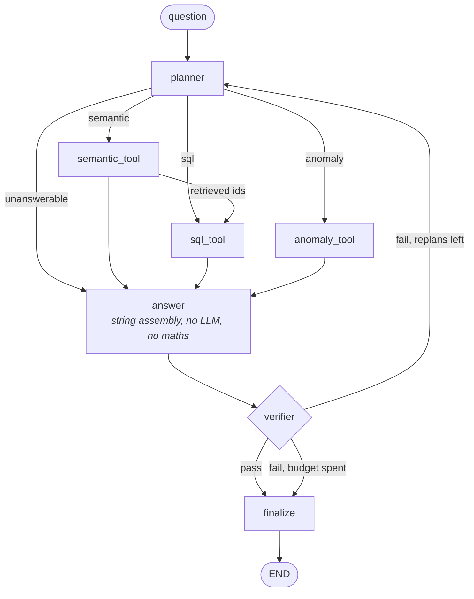

# LedgerLens

An agentic personal expense analyst that reads your bank statements, normalizes them into
SQLite, and answers questions in natural language — with every number traced back to a query
result. Asking "how much did I spend on groceries in March?" of a general-purpose chatbot gets
you a confident number with no provenance, which in a financial context is worse than no answer
at all. LedgerLens makes that structurally impossible: the LLM writes SQL and SQLite computes,
a verifier rejects any figure in an answer that doesn't appear in a retrieved row, and every
state change waits on an explicit human approval. It also works the other direction — once a
month it runs deterministic detectors over the ledger and tells you what changed without being
asked.

---

## Architecture

The query path is a LangGraph `StateGraph` with a replan cycle:



Three things about this shape are deliberate:

- **`answer` does no arithmetic.** It formats retrieved rows and nothing else. Anything it
  invented would be a figure with no provenance, and the verifier would reject it anyway.
- **`semantic` runs before `sql`.** Retrieval produces transaction IDs that SQL then aggregates,
  so the ordering is a data dependency, not a preference.
- **Hitting the replan cap is a legitimate outcome.** An honest "I couldn't verify this" beats a
  confident wrong number, so the graph is allowed to finish without an answer.

Writes live in a second, smaller graph (§8), which pauses on `interrupt`:


`propose` opens a read-only connection; `apply` is the only writable connection in the agent
path. The pause is the mechanism, not a check — a function that decides and writes can always be
called with the decision defaulted, but a graph parked on an interrupt has no default to default
to.

---

## Metrics

All figures below are measured, reproducible from this repo, and recorded in
`evals/golden_results.json`. Model: `llama-3.3-70b-versatile` on Groq. Data: the seeded synthetic
ledger (832 transactions, 12 months, 22 merchants).

### Query accuracy — 53 golden queries

| Metric | Value |
|---|---|
| Execution accuracy, answerable questions | **80.4%** (37/46) |
| Refusal accuracy, unanswerable questions | **100%** (7/7) |
| Whole golden set | **83.0%** (44/53) |
| SQL validity, first attempt | 100% |
| SQL validity, after repair | 100% |
| Queries rescued by the repair loop | 0 |
| Median latency | 4.63 s |
| p90 latency | 5.63 s |
| Median tokens per query | 958 in / 56.5 out |
| Cost per query | ~$0.0006 |

```
python evals/run_golden_eval.py
```

The repair loop rescued nothing on this run, and that is worth stating plainly rather than
hiding: with the 70B, first-attempt SQL validity is already 100%, so there is nothing left for it
to repair. It earned its place against the 8B (95.7% first-attempt) and is now insurance.

### Verifier — inject wrong numbers, confirm rejection

| Metric | Value |
|---|---|
| Catch rate on corrupted answers | **100%** (126/126) |
| False rejection rate on correct answers | **0%** (0/32) |

```
python evals/run_verifier_eval.py
```

Both numbers are reported together on purpose. A verifier that rejects everything scores 100%
catch and is worthless; one that rejects correct answers is worse than absent, because it teaches
the reader to ignore the verdict. Corruptions are multiplicative (±20%, ±35%, ×2, ×10) and any
that land inside rounding tolerance are discarded as invalid trials rather than counted as misses.
The verifier runs entirely on retrieved rows — no LLM, no network, fully deterministic.

### Merchant resolution — 200 hand-labeled descriptors

| Metric | Value |
|---|---|
| Cluster accuracy (0 splits, 0 merges across the 18 labeled merchants) | **100%** |
| Exact canonical-string match | 84.5% |
| Resolved without an LLM call | **96.9%** |

```
python evals/run_merchant_eval.py
```

Cluster accuracy is the number that matters and exact match is the cosmetic one. A *split* —
one real merchant landing on two canonical entries — is invisible per-row and fatal in aggregate,
because every query for that merchant silently returns a fraction of its true total. Exact match
penalizes `AMC` vs `AMC Theatres`, which changes no total anywhere. An earlier version of this
scorer used prefix matching and gave a 5-way merchant split a 95% score; that is why splits now
get their own metric.

### Categorization — the same 200 labels

| Metric | Rules on | Rules ablated |
|---|---|---|
| Accuracy | 100% | 100% |
| Resolved without an LLM call | 100% | 97.7% |
| Transactions reaching the LLM tier | 0 | 19 |

```
python evals/run_merchant_eval.py --ablate-rules
```

**Read both columns, and read the caveat.** The 14 seeded regexes were written knowing this
merchant catalog, so scoring them against it measures how well the rules were written, not how
well the pipeline generalizes — which is why `--ablate-rules` exists. Deleting them forces every
unseen merchant through the LLM tier and lets the learned write-back propagate that decision,
mistakes included. Two further limits: the 200 labels come from the same generator as the
transactions, so neither column is a generalization estimate; and the ablated run is a single
run I was unable to repeat before exhausting the daily API quota. An earlier ablation on
`llama-3.1-8b-instant` scored 97.0%.

### Model selection

`llama-3.3-70b-versatile` over `llama-3.1-8b-instant`, measured on the golden set at the time of
the switch: **67.4% vs 52.2%** execution accuracy, **100% vs 95.7%** first-attempt SQL validity,
**7.6 s vs 13.7 s** median latency — the larger model is faster end-to-end because it needs no
repair round trips.

The honest reading: the 8B's run-to-run noise floor is 2.2 points, but the 70B's own is 10.9
points, so a +15.2 point gap is suggestive rather than decisive. Two prompt rewrites on the 8B
moved accuracy by −4.4 and −2.2 points, both inside its noise — measuring the noise floor first
is what stopped me from shipping either as an improvement.

### Where the 9 remaining failures come from

| Cause | Count |
|---|---|
| Sign convention (`amount` is negative for outflow) | 4 |
| Aggregation level (per-transaction vs per-month) | 2 |
| Wrong `type` filter (fees are `type='fee'`, not `'purchase'`) | 1 |
| Wrong date range | 1 |
| Correct row, wrong column returned | 1 |

The dominant failure class is a single schema convention. `ORDER BY typical_amount DESC` returns
the *cheapest* recurring charge; `SUM(income) - SUM(purchase)` *adds* spending to income. These
are the failures the safety nets cannot catch: the SQL is valid, it executes, it returns a
number, and the verifier confirms that number came from a row — because it did. **Safety nets
catch failure, not wrongness.** The repair loop only sees exceptions, confidence thresholds only
see uncertainty, and a confidently wrong query looks exactly like a right one from the outside.
Fixing this class means teaching the sign convention in the prompt, not adding another guard.

---

## Setup

```bash
git clone <repo> && cd ledgerlens
python -m venv myenv && myenv/bin/pip install -r requirements.txt
echo 'GROQ_API_KEY="gsk_..."' > .env
myenv/bin/python -m ledgerlens.synthetic
myenv/bin/python -m ledgerlens.ingest --init --resolve data/synthetic/transactions.csv
```

Then either ask questions from the API:

```bash
myenv/bin/uvicorn ledgerlens.api.main:app --reload   # http://127.0.0.1:8000/docs
```

or run the suites:

```bash
myenv/bin/python -m pytest                       # 152 tests, no network
myenv/bin/python evals/run_evals.py --verifier   # deterministic, needs no API key
myenv/bin/python evals/run_evals.py              # + the golden set
myenv/bin/python evals/run_evals.py --rebuild    # + merchant/categorization
```

`--rebuild` is opt-in because it re-ingests the synthetic ledger from scratch, which deletes
`ledger.db`. That is correct for a benchmark and destructive for anyone with real statements
loaded.

### Using it on your own statements

`ledger.db` is the **benchmark** ledger — the golden set's expected values are counts and sums
over exactly those 832 synthetic rows, so a real statement landing in it silently invalidates the
answer key. Point real data somewhere else:

```bash
LEDGERLENS_DB=private.db myenv/bin/python -m ledgerlens.ingest --init statement.pdf
LEDGERLENS_DB=private.db myenv/bin/uvicorn ledgerlens.api.main:app --reload
```

Unset, everything behaves exactly as before. `*.db` is gitignored, as is `data/private/`.

Two things to expect from a **checking** statement: most rows are `transfer`, not `purchase` —
card payments, Zelle, internal moves — and §4 has every analytic filter on `type = 'purchase'`,
so spending totals will legitimately read near zero. Purchases live on the card statement. The
parser also refuses a file whose transactions don't reconcile against the printed running
balance, which is the cheapest way to catch a misparse before it becomes ground truth.

### Endpoints

| Route | Purpose |
|---|---|
| `POST /ingest` | upload a statement; re-uploading the same file is a safe no-op |
| `POST /ask` | ask a question; returns the answer *and* its verification verdict |
| `GET /stats` | what is in the open database, starting with which file it is |
| `GET /transactions` | paged, filterable rows (`q`, `type`, `source`, `limit`, `offset`) |
| `GET /digest/{YYYY-MM}` | run the proactive detectors for a month |
| `POST /approvals` | propose a change — returns a diff, writes nothing |
| `POST /approvals/{id}/decide` | approve or reject; the only path to a write |

### Approvals from the CLI

```console
$ python -m ledgerlens.approvals recategorize merchant_id=6 category=shopping

PENDING  CVS Pharmacy: health → shopping (38 transactions)
  before {"merchant": "CVS Pharmacy", "category": "health", "transactions": 38}
  after  {"merchant": "CVS Pharmacy", "category": "shopping"}
  (38 transactions affected, nothing written yet)

apply? [y/N] y
applied  {"transactions_updated": 38, "category": "shopping"}
```

Rejecting writes nothing. Approving records the correction *and* restates history — a correction
that only affects future ingests leaves every past total disagreeing with the user who just made
it. Each proposal also carries a fingerprint of its `before` state and is refused if the ledger
moved underneath it, so an approval is consent to one specific diff rather than standing
permission.

---

## What this doesn't do

- **No bank API, no connection to any account.** It reads statement files you hand it.
- **It cannot move money.** There is no code path that could, in any configuration.
- **It is not financial advice.** It reports what your statements say. Questions like *"should I
  invest in index funds?"* or *"am I on track to retire?"* are refused by design, and refusal
  accuracy is a benchmarked metric rather than a disclaimer.
- **It does not forecast.** *"What will I spend next month?"* is refused — the ledger records
  what happened, and projecting from it would be inventing a number with no row behind it.
- **Inference is hosted, not local.** This deviates from the original local-only design. Merchant
  descriptors, category names and aggregate figures are sent to Groq; raw statements are not
  uploaded, and the proactive digest narrates from findings rather than transactions. If that
  trade is unacceptable for your data, point `llm.py` at a local Ollama model — nothing above it
  depends on the provider.
- **It reads Chase personal checking statements and nothing else.** `REGISTRY` holds two
  adapters: the synthetic CSV and `ChaseCheckingPDF`. Any other bank gets an explicit
  `UnknownFormat` rather than a plausible-looking wrong parse, and a scanned PDF gets
  `NoTextLayer` — there is no OCR in the stack. Adding a bank means writing a `matches`/`parse`
  pair.
- **All the metrics above are measured on synthetic data.** The Chase adapter is exercised
  against a real statement and unit-tested, but every accuracy figure in this README comes from
  the seeded generator. Read them as measuring the pipeline, not the world.
- **Approvals are per-process.** The interrupt uses an in-memory checkpointer, so a pending
  proposal does not survive a restart. A persistent checkpointer is a drop-in change; it just
  isn't made yet.

---

## Layout

```
ledgerlens/
├── schema.sql            conventions locked here: negative = outflow, ISO dates
├── db.py                 connections; read-only helper is the SQL tool's real guard
├── ingest/               parse → dedup → merchants → categorize → recurring
├── agent/
│   ├── graph.py          the StateGraph above
│   └── nodes/            planner, sql_tool, semantic_tool, anomaly_tool, verifier
├── proactive/            §7 detectors + monthly digest
├── approvals/            §8 interrupt-gated writes
└── api/main.py           FastAPI surface
evals/                    golden set, labeled data, and the scripts behind every number above
tests/                    152 tests, no network
```

## Demo

*Not yet recorded.* The 60-second path is: `POST /ask` with "how much did I spend on dining in
March 2026?" → plan → generated SQL → verified answer → `GET /digest/2026-07` → a proposal from
the digest → approve → the same question returning a changed number.
